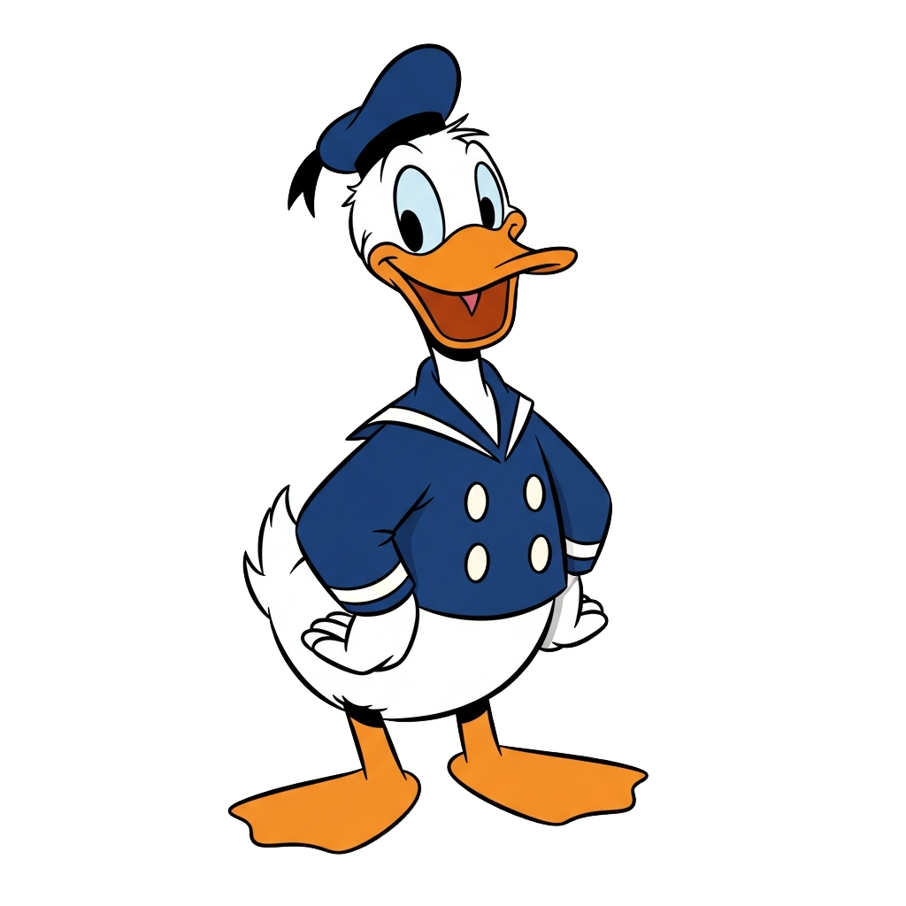
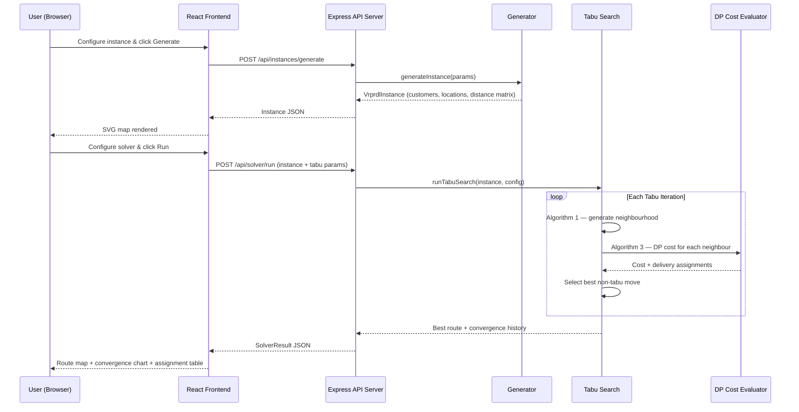
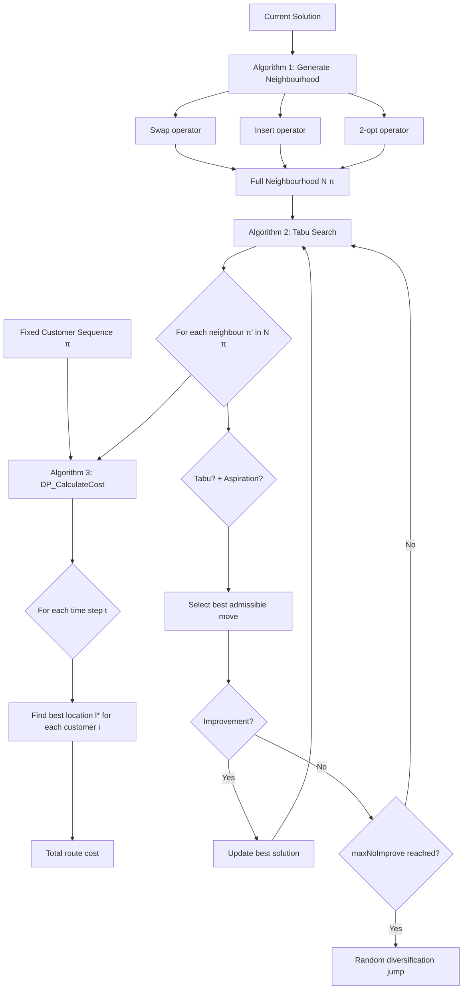

<div align="center">


#  VRPRDL Solver ⚓

**Three Algorithms, One Route: Smarter Last-Mile Delivery, Optimal Decisions.**

*Oh boy oh boy oh boy — it's an optimization workbench!*

</div>

[](https://nodejs.org/)
[](https://www.typescriptlang.org/)
[](https://reactjs.org/)
[](https://expressjs.com/)
[](https://vitejs.dev/)

*A full-stack academic optimization workbench implementing the Vehicle Routing Problem with Roaming Delivery Locations (VRPRDL) using Tabu Search metaheuristics and Dynamic Programming — built from scratch based on the original paper.*

**🌐 Live Demo:** https://vrprdl-solver.apr0je.replit.app

---

##  What Is This?

**VRPRDL Solver** is a complete, interactive implementation of the optimization problem introduced by Reyes, Savelsbergh & Toriello (2017) in *Transportation Research Part C, 80, 71–91*.

In the VRPRDL, customers share a vehicle and can receive deliveries at any of several **roaming locations** (e.g. home, work, gym) depending on where they are at the time of delivery. The goal is to find a vehicle route that minimizes total travel cost while ensuring each customer is present at one of their roaming locations when the vehicle arrives.

### ❓ The Problem (Blasted thing!)

Traditional vehicle routing assumes each customer has a single, fixed delivery address. In reality, people are mobile — they move between locations throughout the day. The VRPRDL captures this complexity: customers have time windows at multiple locations, and the solver must find both the optimal visitation sequence **and** the optimal delivery location-time assignment simultaneously.

### 💡 The Solution

This workbench solves the VRPRDL using the exact three-algorithm pipeline from the paper:

- A **Dynamic Programming** cost evaluator (Algorithm 3) that finds optimal delivery assignments for any fixed route
- A **neighbourhood generator** (Algorithm 1) with three move operators (Swap, Insert, 2-opt)
- A **Tabu Search** metaheuristic (Algorithm 2) that explores the solution space while avoiding cycling

The result is a near-optimal route with full delivery assignment details, convergence history, and visual maps.

---

## ✨ Key Features

| Feature | Description |
|---------|-------------|
| 🗺️ **Instance Builder** | Generate general or realistic VRPRDL benchmark instances. Visualizes customers and roaming locations on an interactive 2D SVG map. |
| ⚡ **Tabu Search Solver** | Fully configurable with `maxIter`, `tabuTenure`, and `maxNoImprove`. Returns best route with full delivery assignment and cost breakdown. |
| 📐 **DP Cost Evaluator** | Algorithm 3 from the paper — DP over a discretised time grid to find the globally optimal delivery location and time for every customer. |
| 🔄 **Three Neighbourhood Operators** | Algorithm 1: Swap (exchange two customers), Insert (relocate one customer), 2-opt (reverse a subsequence). |
| 📊 **Convergence Chart** | Recharts line chart showing cost improvement across Tabu Search iterations, including best-so-far and current-solution traces. |
| 📍 **Route Visualizer** | SVG map with directional arrows showing the optimal delivery route, color-coded assignments, and a full tabular breakdown. |
| 📚 **Algorithm Reference** | Academic documentation page with all 5 flowchart images from the paper and pseudocode steps for each algorithm. |
| 🔁 **Job History** | In-memory job store persists all solver runs within the session for parameter comparison. |

---

## 🎨 Theme: Donald Duck Sailor Edition 

The UI is styled in full **Donald Duck cartoon aesthetic**:

- 🟦 **Navy sailor blue** sidebar (`#1a237e`) with the VRPRDL ⚓ anchor logo
- 🟧 **Beak orange** (`#FF8C00`) for active nav, buttons, and chart accents
- 🔵 **Sky blue** (`#e3f2fd`) background across all pages
-  **Cartoon duck watermarks** scattered subtly across every page
- 💬 **Comic Neue** font throughout for that bubbly cartoon handwriting feel
- 🔲 **Chunky cartoon borders** — thick outlines with offset drop-shadows

---

## 🛠️ Tech Stack

### 🔧 Backend / API
- **Node.js 24 + TypeScript 5.9**
- **Express 5** — async route handling
- **Zod** — runtime input/output validation
- **Orval** — OpenAPI → React Query hooks + Zod schemas codegen
- **esbuild** — fast CJS bundle output
- **pino** — structured JSON logging

### 🖼️ Frontend / UI
- **React 18 + Vite**
- **Tailwind CSS** — utility-first styling
- **shadcn/ui** — accessible component library
- **Recharts** — convergence chart visualization
- **Wouter** — lightweight client-side routing
- **TanStack Query** — server state via generated hooks

### 📦 Workspace
- **pnpm workspaces** — monorepo with shared libs
- **OpenAPI 3.1 contract** — source of truth for all API types

---

## 🚀 Getting Started

### 1. Clone the repository
```bash
git clone https://github.com/apr0je/VRPRDLTRY.git
cd VRPRDLTRY
```

### 2. Install dependencies
```bash
pnpm install
```

### 3. Run the application

Start the API server (port 8080):
```bash
pnpm --filter @workspace/api-server run dev
```

Start the frontend in a new terminal (port 22575):
```bash
pnpm --filter @workspace/vrprdl-solver run dev
```

### 4. (Optional) Regenerate API types
If you modify the OpenAPI spec, regenerate all hooks and schemas:
```bash
pnpm --filter @workspace/api-spec run codegen
```

---

## 📁 Repository Structure

```
VRPRDLTRY/
│
├── lib/                                 # SHARED LIBRARIES — Contract & Generated Code
│   ├── api-spec/
│   │   └── openapi.yaml                 #   OpenAPI 3.1 contract (single source of truth)
│   ├── api-client-react/
│   │   └── src/generated/              #   Generated React Query hooks (via Orval)
│   └── api-zod/
│       └── src/generated/              #   Generated Zod schemas for server validation
│
├── artifacts/                           # DEPLOYABLE APPLICATIONS
│   │
│   ├── api-server/                      # Express 5 API Server
│   │   └── src/
│   │       ├── lib/vrprdl/              #   All algorithm implementations
│   │       │   ├── types.ts             #     Shared TypeScript types
│   │       │   ├── generator.ts         #     Instance generators
│   │       │   ├── dp.ts                #     Algorithm 3: DP_CalculateCost
│   │       │   ├── neighborhood.ts      #     Algorithm 1: Swap, Insert, 2-opt
│   │       │   └── tabu.ts              #     Algorithm 2: Tabu Search
│   │       └── routes/                  #   Express route handlers
│   │           ├── instances.ts
│   │           ├── solver.ts
│   │           └── algorithms.ts
│   │
│   └── vrprdl-solver/                   # React + Vite Frontend
│       ├── index.html                   #   Comic Neue font loaded here
│       └── src/
│           ├── index.css                #   Donald Duck theme tokens
│           ├── App.tsx                  #   Router and layout
│           ├── components/
│           │   └── layout.tsx           #   Sailor sidebar + duck watermarks
│           └── pages/
│               ├── instance-builder.tsx
│               ├── solver.tsx
│               ├── results.tsx
│               └── algorithms.tsx
│
├── assets/                              # Banner and icon images
├── attached_assets/                     # Flowchart images from the paper
├── pnpm-workspace.yaml
├── tsconfig.json
└── README.md
```

> **Design Principle:** All algorithm logic lives exclusively in `artifacts/api-server/src/lib/vrprdl/`. The frontend never runs any optimization logic — it is purely a visualization and control surface.

---

## 🏗️ System Architecture

The solver is built on a **contract-first API architecture**. The OpenAPI spec drives all type generation, ensuring the frontend and backend are always in sync.

### 1. Request & Solve Flow



### 2. Algorithm Pipeline



---

## 📡 API Endpoints

| Method | Endpoint | Description |
|--------|----------|-------------|
| `POST` | `/api/instances/generate` | Generate a VRPRDL instance (general or realistic) |
| `POST` | `/api/solver/run` | Run Tabu Search and return the full result |
| `GET`  | `/api/solver/result/:jobId` | Get a specific job result by ID |
| `GET`  | `/api/solver/jobs` | List all solver jobs in the current session |
| `GET`  | `/api/algorithms/info` | Get algorithm descriptions and parameter info |

---

## 🔮 Roadmap

- [ ] **Persistent Job Storage** — Replace in-memory `Map` with SQLite so results survive server restarts
- [ ] **Multi-Vehicle Extension** — Extend DP and Tabu Search to support vehicle fleets
- [ ] **Parameter Auto-Tuning** — Grid-search mode that tries multiple Tabu Search configurations
- [ ] **Export Results** — Download optimal route and assignment table as CSV or JSON
- [ ] **Benchmark Comparison** — Add a greedy nearest-neighbour baseline to measure Tabu Search improvement

---

<div align="center">


&nbsp;&nbsp;&nbsp;

&nbsp;&nbsp;&nbsp;


*Built for academic demonstration of combinatorial optimization metaheuristics.*

Based on: *Reyes, Savelsbergh & Toriello (2017), Transportation Research Part C 80, 71–91.*


&nbsp;&nbsp;&nbsp;

&nbsp;&nbsp;&nbsp;


</div>
