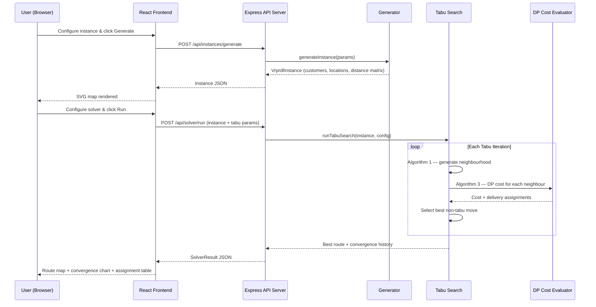
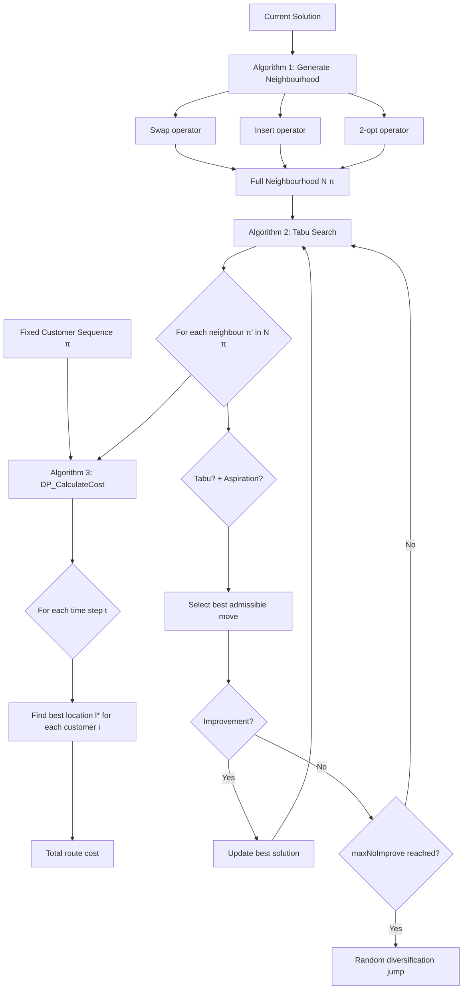

<div align="center">

  # ⭐ VRPRDL Solver
  **Three Algorithms, One Route: Smarter Last-Mile Delivery, Optimal Decisions.**

</div>

[](https://nodejs.org/)
[](https://www.typescriptlang.org/)
[](https://reactjs.org/)
[](https://expressjs.com/)
[](https://vitejs.dev/)

*A full-stack academic optimization workbench implementing the Vehicle Routing Problem with Roaming Delivery Locations (VRPRDL) using Tabu Search metaheuristics and Dynamic Programming — built from scratch based on the original paper.*

**Live Demo:** https://vrprdl-solver.apr0je.replit.app

---

## 📖 Project Overview

**VRPRDL Solver** is a complete, interactive implementation of the optimization problem introduced by Reyes, Savelsbergh & Toriello (2017) in *Transportation Research Part C, 80, 71–91*.

In the VRPRDL, customers share a vehicle and can receive deliveries at any of several **roaming locations** (e.g. home, work, gym) depending on where they are at the time of delivery. The goal is to find a vehicle route that minimizes total travel cost while ensuring each customer is present at one of their roaming locations when the vehicle arrives.

### ❓ Why this project exists (The Problem)
Traditional vehicle routing assumes each customer has a single, fixed delivery address. In reality, people are mobile — they move between locations throughout the day. The VRPRDL captures this complexity: customers have time windows at multiple locations, and the solver must find both the optimal visitation sequence and the optimal delivery location-time assignment simultaneously.

### 💡 The Solution
This workbench solves the VRPRDL using the exact three-algorithm pipeline from the paper: a **Dynamic Programming** cost evaluator (Algorithm 3) that finds optimal delivery assignments for any fixed route, a **neighbourhood generator** (Algorithm 1) with three move operators (Swap, Insert, 2-opt), and a **Tabu Search** metaheuristic (Algorithm 2) that explores the solution space while avoiding cycling. The result is a near-optimal route with full delivery assignment details, convergence history, and visual maps.

---

## ✨ Key Features

- **🗺️ Instance Builder**: Generate general or realistic VRPRDL benchmark instances with configurable customer counts, roaming locations per customer, and time window parameters. Visualizes customers and roaming locations on an interactive 2D SVG map.
- **⚡ Tabu Search Solver**: Fully configurable metaheuristic with `maxIter`, `tabuTenure`, and `maxNoImprove` controls. Returns the best route found with full delivery assignment and cost breakdown.
- **📐 Dynamic Programming Cost Evaluator**: Algorithm 3 from the paper — given a fixed customer sequence, uses DP over a discretised time grid to find the globally optimal delivery location and time for every customer simultaneously.
- **🔄 Three Neighbourhood Operators**: Algorithm 1 implements Swap (exchange two customers), Insert (relocate one customer), and 2-opt (reverse a subsequence) — all applied exhaustively at each Tabu Search iteration.
- **📊 Convergence Chart**: Real-time Recharts line chart showing cost improvement across Tabu Search iterations, including best-so-far and current-solution traces.
- **📍 Route Visualizer**: SVG map with directional arrows showing the optimal delivery route, color-coded delivery assignments, and a full tabular breakdown of customer → location → arrival time.
- **📚 Algorithm Reference**: Academic documentation page with all 5 flowchart images from the paper and pseudocode steps for each algorithm.
- **🔁 Job History**: In-memory job store persists all solver runs within the session, allowing comparison of different parameter configurations.

---

## 🛠️ Tech Stack

### Backend / API
- **Node.js 24 + TypeScript 5.9**
- **Express 5** (High-performance async route handling)
- **Zod** (Runtime input/output validation)
- **Orval** (OpenAPI → React Query hooks + Zod schemas codegen)
- **esbuild** (Fast CJS bundle output)
- **pino** (Structured JSON logging)

### Frontend / UI
- **React 18 + Vite**
- **Tailwind CSS** (Utility-first styling)
- **shadcn/ui** (Accessible component library)
- **Recharts** (Convergence chart visualization)
- **Wouter** (Lightweight client-side routing)
- **TanStack Query** (Server state management via generated hooks)

### Workspace
- **pnpm workspaces** (Monorepo with shared libs)
- **OpenAPI 3.1 contract** (Source of truth for all API types)

---

## 🚀 Getting Started

### 1. Clone the repository
```bash
git clone https://github.com/apr0je/VRPRDLTRY.git
cd VRPRDLTRY
```

### 2. Install dependencies
```bash
pnpm install
```

### 3. Run the application
Start the API server (port 8080):
```bash
pnpm --filter @workspace/api-server run dev
```
Start the frontend in a new terminal (port 22575):
```bash
pnpm --filter @workspace/vrprdl-solver run dev
```

### 4. (Optional) Regenerate API types
If you modify the OpenAPI spec, regenerate all hooks and schemas:
```bash
pnpm --filter @workspace/api-spec run codegen
```

---

## 📁 Repository Structure

The codebase is organized as a **pnpm monorepo** with three layers: shared libraries (contract + generated code), the API server (all algorithm logic), and the React frontend.

```
VRPRDLTRY/
│
├── 📂 lib/                              # ◈ SHARED LIBRARIES — Contract & Generated Code
│   ├── 📂 api-spec/
│   │   └── openapi.yaml                 #   OpenAPI 3.1 contract (single source of truth)
│   ├── 📂 api-client-react/
│   │   └── src/generated/              #   Generated React Query hooks (via Orval)
│   └── 📂 api-zod/
│       └── src/generated/              #   Generated Zod schemas for server validation
│
├── 📂 artifacts/                        # ◈ DEPLOYABLE APPLICATIONS
│   │
│   ├── 📂 api-server/                   # Express 5 API Server
│   │   └── src/
│   │       ├── 📂 lib/vrprdl/           #   All algorithm implementations
│   │       │   ├── types.ts             #     Shared TypeScript types (VrprdlInstance, etc.)
│   │       │   ├── generator.ts         #     General & realistic instance generators
│   │       │   ├── dp.ts                #     Algorithm 3: DP_CalculateCost
│   │       │   ├── neighborhood.ts      #     Algorithm 1: Swap, Insert, 2-opt operators
│   │       │   └── tabu.ts              #     Algorithm 2: Tabu Search metaheuristic
│   │       └── 📂 routes/              #   Express route handlers
│   │           ├── instances.ts         #     POST /api/instances/generate
│   │           ├── solver.ts            #     POST /api/solver/run, GET /api/solver/*
│   │           └── algorithms.ts        #     GET /api/algorithms/info
│   │
│   └── 📂 vrprdl-solver/               # React + Vite Frontend
│       └── src/
│           ├── App.tsx                  #   Router and layout
│           ├── 📂 pages/               #   Instance Builder, Solver, Results, Algorithms
│           └── 📂 components/          #   SVG map, convergence chart, UI widgets
│
├── 📂 attached_assets/                  # Flowchart images from the paper
├── pnpm-workspace.yaml                  # Workspace config, catalog pins
├── tsconfig.json                        # Root TypeScript solution file
└── README.md
```

> **Design Principle:** All algorithm logic lives exclusively in `artifacts/api-server/src/lib/vrprdl/`. The API layer only validates inputs and calls into that library. The frontend never runs any optimization logic — it is purely a visualization and control surface.

---

## 🏗️ System Architecture

The solver is built on a **contract-first API architecture**. The OpenAPI spec drives all type generation, ensuring the frontend and backend are always in sync without manual type maintenance.

### 1. Request & Solve Flow



### 2. Algorithm Pipeline

The three algorithms from the paper are implemented as pure TypeScript functions with no external dependencies:



### 3. Contract-First Codegen

The OpenAPI spec at `lib/api-spec/openapi.yaml` is the single source of truth. Running `pnpm --filter @workspace/api-spec run codegen` generates:
- **React Query hooks** in `lib/api-client-react/` — used by all frontend components
- **Zod schemas** in `lib/api-zod/` — used by the Express server for runtime validation

This eliminates an entire class of frontend/backend type-mismatch bugs.

---

## 📡 API Endpoints

| Method | Endpoint | Description |
|--------|----------|-------------|
| `POST` | `/api/instances/generate` | Generate a VRPRDL instance (general or realistic) |
| `POST` | `/api/solver/run` | Run Tabu Search and return the full result |
| `GET`  | `/api/solver/result/:jobId` | Get a specific job result by ID |
| `GET`  | `/api/solver/jobs` | List all solver jobs in the current session |
| `GET`  | `/api/algorithms/info` | Get algorithm descriptions and parameter info |

---

## 🔮 Future Improvements / Roadmap

- [ ] **Persistent Job Storage**: Replace in-memory `Map` with a lightweight SQLite store so results survive server restarts.
- [ ] **Multi-Vehicle Extension**: Extend the DP and Tabu Search to support fleets of vehicles (the full VRP-RDL variant).
- [ ] **Parameter Auto-Tuning**: Add a grid-search mode that tries multiple Tabu Search configurations and returns the best-performing one.
- [ ] **Export Results**: Allow users to download the optimal route and assignment table as CSV or JSON.
- [ ] **Benchmark Comparison**: Add a greedy nearest-neighbour baseline so users can see the Tabu Search improvement percentage clearly.

---

<div align="center">
  <p>Built for academic demonstration of combinatorial optimization metaheuristics.</p>
  <br />
  <p>Based on: <em>Reyes, Savelsbergh & Toriello (2017), Transportation Research Part C 80, 71–91.</em></p>
</div>
